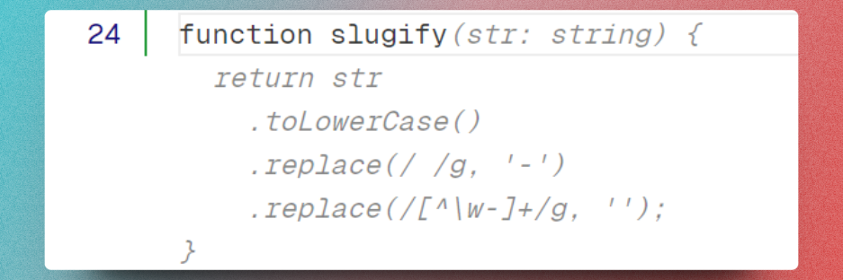
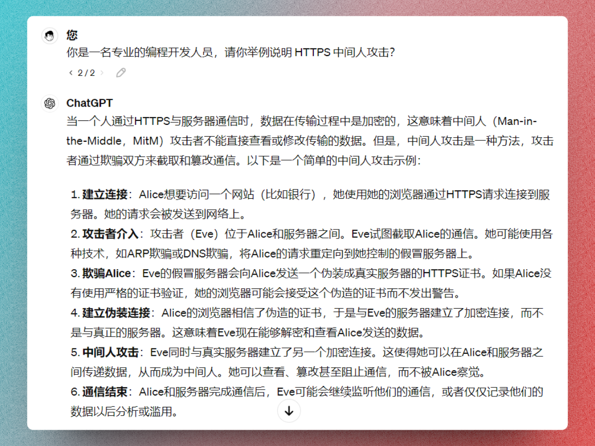
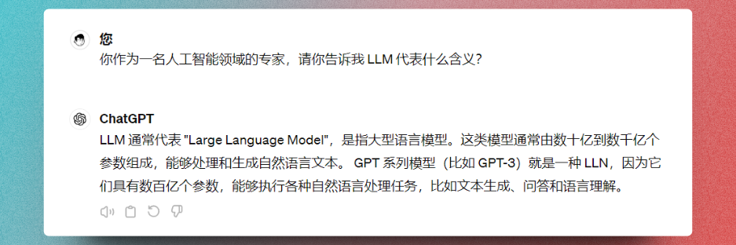
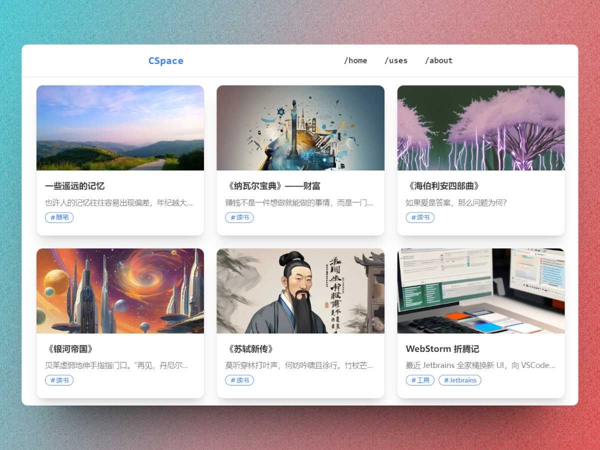
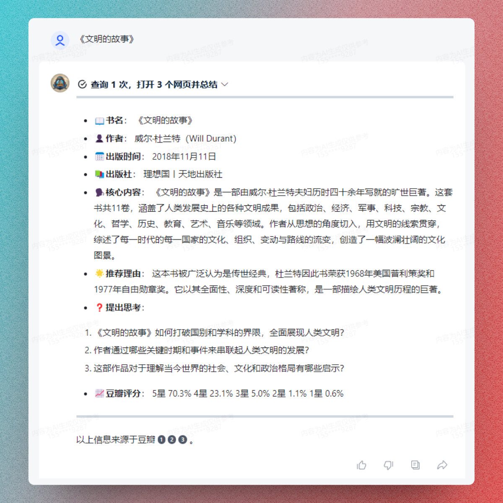

## 等等...这个单词什么意思

在用 AI 的过程中，不出意外会碰到一些英文名词，例如 AIGC、AGI、 LLM、Prompt 等等。这些都是什么意思呢，我问过同样的问题，我选择把球交给 AI，你可以继续往下看这篇文章，或者随便打开一个 AI 助手，这样问它：

```
你作为一名人工智能领域的专家，请你告诉我 AIGC 代表什么含义？
```

AIGC（AI-Generated Content）人工智能生成内容，人工智能通过网络上现存的海量数据生成的新内容，包括音频、 图片、文章、代码，而且 AI 在一些更具创意性的领域（音乐、视频）也开始追赶人类的脚步，例如 Suno 可以生成音乐，Sora 可以生成视频。

AGI（Artificial General Intelligence）通用人工智能，在[《AI3.0》](https://book.douban.com/subject/35351678/)这本书里作者把它叫做人类智能，我觉得更贴切，像人类一样拥有广泛认知能力（推理、经验、常识）的智能系统。这是人工智能发展的终极目标。

LLM（Large Language Model）大语言模型，经常见之于最新科技新闻。为什么说它大，因为它的训练参数数量很多，能够处理大规模的自然语言文本。比如最新发布的 Llama-3-70B 开源模型，它的训练参数就达到了 700 亿。它的表现形式就是各大厂商推出的 Chat Bot。

Prompt 通常叫做提示词，可以是一个单词、一句话、一段文本或者一个问题，用来引导人工智能生成你想要的内容。比如“你好”和“你作为一名人工智能领域的专家，请你告诉我 AGI 代表什么含义？”，这两个都是提示词。通常，设计合理的 Prompt 可以生成更准确、质量更高的内容。

还有很多，这种名词你对 AI 使用程度越高，出现的会越多，不过 AI 在解答这种问题的时候完全可以信任，你可以试着结合上面提示词去了解更多。

## AI 在做什么

AI 始于 1956 年[达特茅斯会议](https://baike.baidu.com/item/%E8%BE%BE%E7%89%B9%E8%8C%85%E6%96%AF%E4%BC%9A%E8%AE%AE/22287232)；1997 年机器学习应用于 IBM 深蓝计算机，击败了国际象棋冠军；2016 年 DeepMind 的人工智能棋手 AlphaGo 战胜了围棋世界冠军；2023 年 OpenAI 发布了 ChatGPT，随后，各种大语言模型 AI 如雨后春笋般冒了出来。那在这个过程中 AI 到底在做什么？

深蓝计算机得益于当时提出的机器学习，击败了卡斯帕罗夫，但是，它除了下棋，啥也不会。

AlphaGo 战胜了李世石，甚至它的进化版 AlphaGo Master 更恐怖，战胜了柯洁，可是，它除了下棋，啥也不会。

ChatGPT 作为一个文本模型，它在处理自然语言方面可能百试百灵，但是，它不会下棋，所以它也不是通用人工智能。

在这几个人工智能发展的高潮阶段，都有一种声音：“人类要被人工智能超越了”。但是经历过后才发现，我们距离人工智能还有很远的距离。我们对此的误解是，人类往往容易高估了人工智能，而低估了人类智能。

那么 AI 到底在做什么？我想举几个例子，答案会很明确：

| AI 助手                                               | 功能 OR 领域                                       |
| ----------------------------------------------------- | -------------------------------------------------- |
| [ChatGPT](https://chat.openai.com/)                   | 自然语言处理，生成文本、翻译，通过插件可以做更多事 |
| [Midjourney](https://www.midjourney.com/home)         | 图像生成                                           |
| [Suno](https://suno.com/)                             | 音乐生成                                           |
| [Sora](https://openai.com/sora)                       | 视频生成                                           |
| [DeepL](https://www.deepl.com/translator)             | 语言翻译                                           |
| [GitHub Copilot](https://github.com/features/copilot) | 代码生成                                           |
| [智谱清言](https://chatglm.cn/)                       | 自然语言处理，可以自建智能体                       |
| [通义千问](https://tongyi.aliyun.com/qianwen/)        | 同上                                               |
| [通义灵码](https://tongyi.aliyun.com/lingma)          | 代码生成                                           |
| [FSD](https://baike.baidu.com/item/FSD/55555932)      | 特斯拉 L2 级别自动驾驶                             |
| 推荐系统                                              | 常见于电商网站，猜你喜欢等功能                     |

我们把这种专门应用与某一领域的 AI 成为 [Narrow AI（窄 AI）](https://baike.baidu.com/item/%E5%BC%B1%E4%BA%BA%E5%B7%A5%E6%99%BA%E8%83%BD/10403703)，如果超出了学习和决策范围，它们能做的非常有限。也正是得益于大模型在 2023 年的爆发，AI 在日常生活和工作中的使用范围已经非常大了。

## 我可以用 AI 做什么

### 代码副驾

首先作为程序员，GitHub Copilot 是我使用频率最高的写代码辅助工具，VSCode 和 JetBrains 全家桶都安装了这个插件。可以简单感受一下它的能力：



如果在使用过程中，你能够用合理的函数名称配合文档注释，Copilot 有能力为你生成完整的代码逻辑，这还不说它的 fix 功能和重构功能，能帮你识别潜在的逻辑漏洞，从提高效率角度来说一点问题没有，你要做的只是 Review。

### 概念解释机

我不是万青（万能青年），在碰到一些不熟悉的概念时，我会把它扔给 AI，让 AI 给我解释说明：



或者解释上面提到的一些专有名词：



当然，AI 不可全信，因为 AI 也会产生幻觉，比如超出它理解范围的，它可能会胡编乱造一个答案给你。就像这个回答里的 LLN 其实应该是 LLM，多有对待 AI 其实和看书是一样的，实践是检验一切的标准。

### 图片生成

最近在我自己的网站，我打算给每篇文章配上一张题图，但我不是万青，所以想到了用 AI 来生成，有几张图片我还挺喜欢，但是如果不仔细写 Prompt 的话，生成的图片差强人意。



### 书籍探索

最近读书，很多书看着看着就不想看了，弃了很多书，并非没有耐心，而是书中的内容和预期中的相去甚远。看到有人在网上分享读书的 Prompt，我就在智谱清言里创建了一个智能体，让它帮我先筛一遍我要读的书，看到不中意的我直接弃了，省得读到一半白费力气。



你可以直接体验[书海无涯智能体](https://chatglm.cn/agentShare?id=660bca95fd90b2aff79e10a9&is_share=1&share_from=pc)。

还有很多，AI 能做的远不止于此，在创意性领域 AI 的已经开始追赶人类的脚步，所以，用起来，你才能知道 AI 能用来干什么。

最后，留个小疑问，你能猜到这篇文章的哪些内容是 AI 生成的吗？
