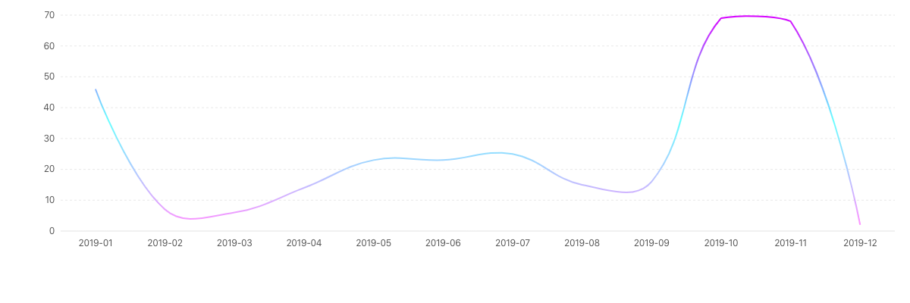
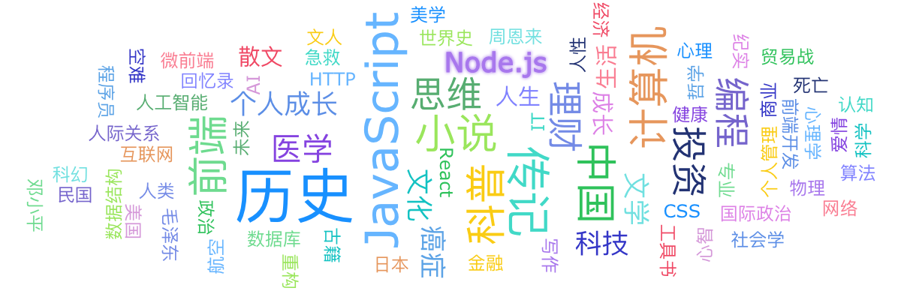
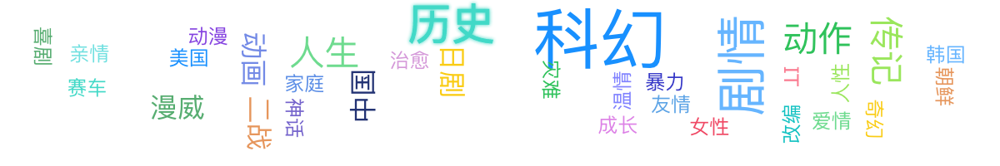

很奇怪的标题对不对？两条无法运行的语句，其实我苦思不得标题，某天脑海中一闪而过，于是决定就它了。

原本的标题是『2019：量化生活』，但以同样的方式把年终总结写了三年，难免让人厌倦，何况我也是一个喜新厌旧的主儿。虽然暗下决心要“量化生活”，但是这篇文章里的数据不会太多，如果真的要量化生活，我想我可能会走进形式主义道路，为了量化而量化。

<h2 style="text-align: center;">01 不写代码<h2>

不写代码，还能干什么？

这些代码。

<h2 style="text-align: center;">02 书不在读<h2>

书不拿来读，还能干什么？

书不在读，有则即可。

<h2 style="text-align: center;">03 一个人的电影<h2>

电影除了一个人看，还能几个人看？

电影作品。

<h2 style="text-align: center;">04 减掉的体重，会以某种方式回归<h2>

不减肥，难道增肥吗？

减肥。

以上。

Enjoy 2020！
