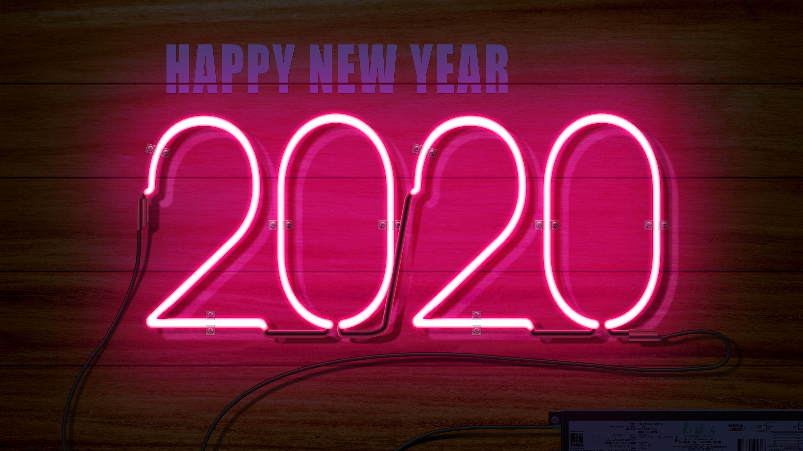

我随着福瓦德·伊本·阿巴斯的脚步来到了这座祥和之城——巴格达，走进那家位于五金市场的店铺。一位老人从门里走了出来。我想那应该就是巴沙拉特。

『我的名字是巴沙拉特，能为您效劳吗？』

『听说您这里有一道年门，可以让人们回到过去旅行？』

『是的，先生。不过这道年门只能让你去到未来，而开罗的年门可以让你回到过去。』

于是我带着巴沙拉特的书信来到了开罗，和年门的主人交谈一番之后，我才知道他是巴沙拉特的儿子，他说会帮助我实现愿望，让我回到过去。『不过您要知道，过去已经发生的事情是无法改变的。』他说。

『不胜感激。』我说。

我站在那个巨大的金属环前，闭着眼睛思索往昔，记忆如胶片一般在眼前闪回。我没有告诉巴沙拉特的儿子，如果有可能我会尽力改变以前的自己，我会告诉我自己在未来的经历，我会让我的未来向我现在所期望的方向发展。我抬腿迈过那道门，不同于年门那边屋子里的热气腾腾，这边白雪皑皑，盖着雪被的山峰一座连着一座，仿佛天的尽头也是山。寒风从我身旁呼啸而过，我正站在故乡地势最高的一座山上，那里人们喜欢把它叫做『梁』，从这里看去，小小的村庄一览无余，袅袅炊烟，鸡鸣狗吠，像极了记忆中小时候的样子，我想能不能从这里一路溜回家。就在我思索今天是什么日子，为什么会回到这一天的时候，我看见一个人拖着行李从我面前走来，再近几步我就认出来了，那是一年前的我自己，我为他没有认出我而暗自舒了一口气。今天是腊月二十八，早上六点钟的时候他从北京出发，风尘仆仆，经过七个小时的颠簸终于来到这里。

『你为什么不直接坐车坐到家门口呢，从这里到你们家还有一段距离呢？』

『我想走走、看看，又一年没回家了，总是希望有时间回来看看，但事与愿违，没能挤出时间。我喜欢这里的生活，春夏秋冬四季分明，生活的热闹和静谧这里都有。』

『以后有的是时间看风景，你现在不应该快点回家吗？』我的话到嘴边却没有说出口，我知道以后看的所有风景都不如这里的风景好看，以后的时间都只是从嘴里说出来的两个字而已。我陪他一起走回了家，路上也没有说什么，我了解他，他不是一个健谈的人。

春节前后的一段日子里都会洋溢着节日的氛围，就像空气中散发的阵阵酒精的气味，绵延悠长而久久不会散去。年三十儿便是这种氛围的顶点，每家每户都关起门来独自享受，为的是不让新春的幸福从门缝里悄悄溜走。但那天发生了一个小插曲，起因是不知道谁放烟花的时候不小心点燃了一垛柴草，引起了一场火灾，火光照亮了除夕的夜晚，正在享受团圆之乐的人们都出来救火了，他也准备去救火，我拉住他，『别去了，小火，一会儿就灭了。』我说，显然这并不能改变什么，他还是去了。火灭了之后，他们又回到了饭桌前吃年夜饭。家里的长辈围成一圈在讨论他的未来，简而言之爱情和事业，那个时候他没有说话，只是偶尔笑笑，我知道他在想什么。我不知道他那时是否明白，这些其实都是为他好，而现在的我却想让他明白，我想告诉他，这些事情大可不必在意，他会有他自己的选择，他会找到自己的路，他会遇到那个对的人。

他挤出时间和老朋友们见了一面，变化没有他想象的那么大，大家都有自己的生活，但是谈起过去似乎永远也有聊不完的话题，他们绕不开的话题是学校时光，匆匆一别，就像很多年已经过去了一样，记忆中永远都是那群最纯真的孩子。我知道后半年还会再次见面，但他还是希望这样的时间能多一些，再多一些。今年是他的本命年，生日那天他许了几个靠谱的愿望，这些我都已经知道了，我知道这些愿望能完整实现的寥寥无几，可我不忍心告诉他。

『请努力吧，未来的你会感激那个努力的你。』我说。

『我知道，我一直很努力，即使偶尔迷茫，但我还会相信远方。』他说，

『是的，远方的田野和诗，你都会有的』我说。

回程的日子到了，他要先坐着去往城里的车，然后在城里搭火车。车在一眼望不到尽头的山峦间颠簸前行，一会儿在谷底，一会儿在山顶，他在狭窄的空间里昏昏欲睡，离开之前，他想再看一眼这里的风景。『一份饺子，一场别离。一杯清茶，一载年华。』我看着他在朋友圈里分享了一条动态。

回到熟悉的城市，车站的人潮汹涌，宿舍里却空空如也，他难掩失落。『用不了多长时间你就会忘记这种感觉，因为工作，工作会填满这种偶尔产生的空虚感。』我说，我希望这能带给他一点慰藉。

『世界上最好的工作是什么，是你心甘情愿去做的工作。』我读到这句话的时候很受触动。他喜欢自己的工作，挑战中不乏乐趣，挫败后收获惊喜。工作的时候紧盯着屏幕，在键盘上敲敲打打，时不时地嘴里还骂骂咧咧，每天面对电脑，体会着电脑的喜怒哀乐，发量其实还可以，不喜欢格子衫。

『戴好你的眼镜，不要在无聊的时候取下来玩弄。』

『为什么？』

『总之记住我的话就好了。』

他写代码的时候，我坐在他身边，我想为他指出他犯的每一个错误，因为这样，他就不必在纠结和自我怀疑之间拉扯；我更想告诉他的是这个需求并不是最终需求，我突然想起巴沙拉特交代给我的事情：过去的事情无法改变，你只能更加深刻地去理解它们。有一天午后他问了我一个问题：『既然我所做的一切最终都会消逝，那此刻我写的这些代码、做的这些事情又有什么意义，时间将会带走一切，对吗？』我从他脸上看出来，他确实很困惑也很纠结。我想他或许把计算机世界的里 0 和 1 当成了自己所追寻的意义。

『诚然你所做的一切都会被时间消磨殆尽，计算机里存储的那堆 0 和 1 并没有什么意义。可是你所寻找的意义就在于写代码时所做的思考，以及这些想法随着代码的执行之后帮助其他人解决的问题，当想法化为行动，一切都是「你自己」赋予其以意义。即使你现在不明白，以后也会明白的。你能做的就是写好每一行代码，尽力确保 Bug 之神不会找到你身上。你问的这个问题，答案也会随着时间沉淀在你的心里。』

……

我在 2019 年的生活已经快和 2020 年的生活齐头并进了，该是时候和他告别了。

『你觉得你这一年过得怎么样，有没有什么遗憾？』我说。

『平平淡淡。你觉得呢？未来的自己。』他望着我的眼睛说。

『人生海海，过去的事情无法改变，当下发生的可以把握，未来能够有所期待，不虚度时光，就是对自己最好的希冀。』我笑着说。

『看上去像是我会说的话。』

『很幸运能陪你走过这段旅程，该是时候说再见了，从现在起，你要靠自己了，你会找到你自己路的。愿幸福与你同在。』

我遵循了我的承诺，向巴沙拉特讲述了所有的事情。

『愿幸福与您同在！』巴沙拉特说。

『愿幸福与您同在！』

---

后记：每到年底总想写点东西，回首过往还是会使人唏嘘，点点滴滴是生活，跌跌撞撞是成长，伴随着分分秒秒流逝。灵感来自于特德·姜的科幻小说《呼吸》中的其中一篇《商人和炼金术士之门》。
